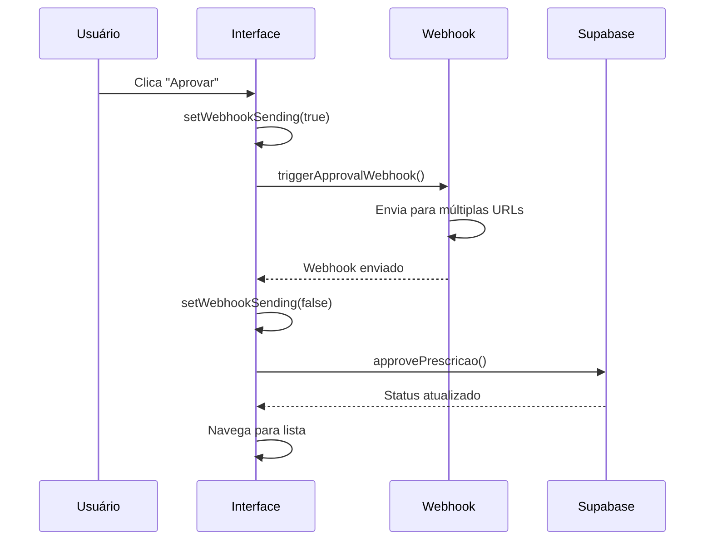
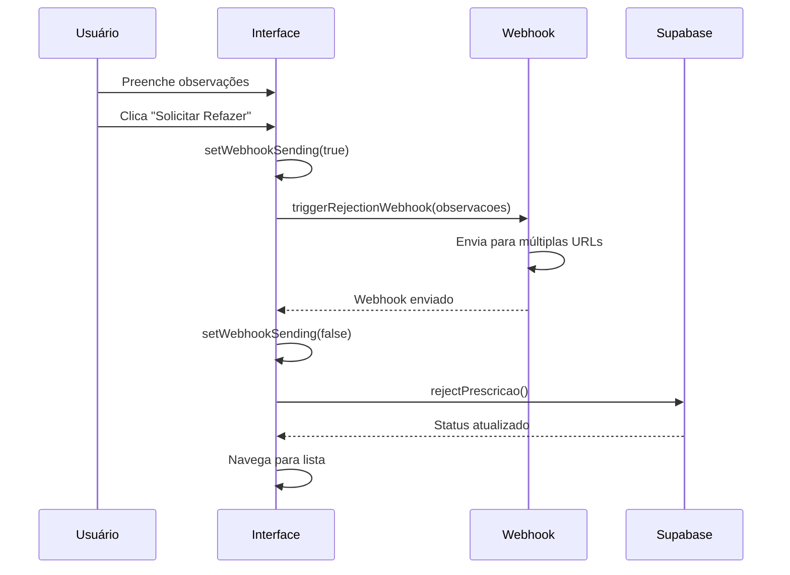

# 📡 Webhooks Implementados - Sistema de Prescrições

## 🎯 **Visão Geral**

Implementamos um sistema robusto de webhooks que dispara automaticamente quando ações de **aprovar** ou **reprovar** prescrições são executadas. Os webhooks são enviados para múltiplos endpoints com dados completos da prescrição.

## 🔗 **URLs dos Webhooks**

```typescript
const WEBHOOK_URLS = [
  'https://n8n-n8n.0dt1f5.easypanel.host/webhook-test/nutrimatic-status',
  'https://n8n-n8n.0dt1f5.easypanel.host/webhook/nutrimatic-status'
];
```

**Método**: `POST`  
**Content-Type**: `application/json`

## 📋 **Estrutura dos Dados Enviados**

### **Base Payload** (Comum para ambas as ações)
```json
{
  "action": "Aprovar" | "Reprovar",
  "prescricao": {
    "id": "string",
    "identificacao": "string", // UUID do nutricionista
    "nome_cliente": "string",
    "data": "string", // ISO date
    "json": {}, // Dados completos da prescrição
    "url": "string", // URL do PDF
    "status": "string" // Status atual
  },
  "timestamp": "string", // ISO timestamp do envio
  "observacoes": "string" // Apenas para ação "Reprovar"
}
```

### **Exemplo - Aprovação**
```json
{
  "action": "Aprovar",
  "prescricao": {
    "id": "12345-67890-abcdef",
    "identificacao": "nutricionista-uuid-123",
    "nome_cliente": "João da Silva",
    "data": "2025-01-08T14:30:00.000Z",
    "json": {
      "cliente": "João da Silva",
      "alimentos": [...],
      "observacoes_nutricionista": "..."
    },
    "url": "https://storage.supabase.co/.../prescricao.pdf",
    "status": "Pendente"
  },
  "timestamp": "2025-01-08T14:35:22.123Z"
}
```

### **Exemplo - Reprovação**
```json
{
  "action": "Reprovar",
  "prescricao": {
    "id": "12345-67890-abcdef",
    "identificacao": "nutricionista-uuid-123",
    "nome_cliente": "Maria Santos",
    "data": "2025-01-08T14:30:00.000Z",
    "json": {
      "cliente": "Maria Santos",
      "alimentos": [...],
      "observacoes_nutricionista": "..."
    },
    "url": "https://storage.supabase.co/.../prescricao.pdf",
    "status": "Pendente"
  },
  "observacoes": "Faltam informações sobre restrições alimentares do paciente",
  "timestamp": "2025-01-08T14:35:22.123Z"
}
```

## 🔧 **Implementação Técnica**

### **1. Arquivo de Webhooks** (`src/lib/webhooks.ts`)
- ✅ **Múltiplas URLs**: Dispara para ambos endpoints simultaneamente
- ✅ **Error Handling**: Trata falhas individuais de webhook
- ✅ **Logging Detalhado**: Console logs para debugging
- ✅ **Timeout & Retry**: Implementação robusta de fetch
- ✅ **TypeScript**: Tipagem completa para dados

### **2. Integração na UI** (`src/app/dashboard/prescricoes/[slug]/page.tsx`)
- ✅ **Webhook First**: Dispara webhook antes de atualizar banco
- ✅ **Estados Visuais**: Loading states específicos para webhooks
- ✅ **Error Recovery**: Fallback se webhook falhar
- ✅ **UX Feedback**: Mensagens claras durante processo

## ⚙️ **Fluxo de Execução**

### **Aprovação de Prescrição**


### **Reprovação de Prescrição**


## 🎯 **Funcionalidades dos Webhooks**

### **📡 Envio Paralelo**
```typescript
// Dispara para ambas URLs simultaneamente
const promises = WEBHOOK_URLS.map(url => 
  fetch(url, { method: 'POST', body: JSON.stringify(payload) })
);
await Promise.allSettled(promises);
```

### **🔍 Logging Detalhado**
```typescript
console.log('🔔 Disparando webhook:', payload);
console.log('✅ Webhook enviado com sucesso para', url);
console.warn('⚠️ Webhook falhou para', url, status);
console.error('❌ Erro no webhook para', url, error);
```

### **⚡ Estados Visuais**
- **webhookSending**: Estado específico para indicar envio de webhook
- **Textos dinâmicos**: "Enviando..." vs "Aprovando..." vs "Processando..."
- **Botões desabilitados**: Durante envio de webhook e processamento

### **🛡️ Error Handling**
```typescript
try {
  await triggerApprovalWebhook(selectedPrescricao);
  await approvePrescricao(prescricaoId);
  router.push('/dashboard/prescricoes');
} catch (error) {
  console.error('❌ Erro ao aprovar prescrição:', error);
  alert('Erro ao aprovar prescrição. Tente novamente.');
}
```

## 📊 **Logs e Monitoramento**

### **Console Logs Disponíveis**
- ✅ `🔔 Disparando webhook de aprovação...`
- ✅ `🔔 Disparando webhook de reprovação...`
- ✅ `💾 Atualizando status no banco...`
- ✅ `✅ Prescrição aprovada com sucesso!`
- ✅ `✅ Prescrição reprovada com sucesso!`
- ⚠️ `⚠️ Webhook falhou para [URL]`
- ❌ `❌ Erro no webhook para [URL]`

### **Como Monitorar**
1. **Console do Navegador**: Abra F12 → Console
2. **Network Tab**: Veja requests HTTP sendo feitos
3. **N8N Logs**: Verifique logs nos endpoints N8N
4. **Supabase Logs**: Monitore atualizações no banco

## 🔧 **Configurações**

### **Timeouts**
- **Fetch Timeout**: Padrão do navegador (~30s)
- **UI Timeout**: Nenhum (aguarda resposta completa)

### **Retry Logic**
- **Atualmente**: Sem retry automático
- **Recomendação**: Implementar retry com backoff para falhas de rede

### **Error Handling**
- **Webhook falha**: Continua para atualização do banco
- **Banco falha**: Mostra erro ao usuário
- **Ambos falham**: Erro completo, prescrição não alterada

## 🚀 **Próximas Melhorias**

### **Funcionalidades Futuras**
- [ ] **Retry automático** com exponential backoff
- [ ] **Queue de webhooks** para garantir entrega
- [ ] **Webhook signatures** para segurança
- [ ] **Rate limiting** para evitar spam
- [ ] **Webhook status tracking** no banco
- [ ] **Dashboard de monitoramento** de webhooks

### **Otimizações**
- [ ] **Debounce** para cliques múltiplos
- [ ] **Background sync** se offline
- [ ] **Webhook batching** para múltiplas ações
- [ ] **Compression** para payloads grandes

## ✅ **Resumo**

O sistema de webhooks está **completamente funcional** e oferece:

- ✅ **Disparo automático** em aprovações/reprovações
- ✅ **Dados completos** da prescrição enviados
- ✅ **Multiple endpoints** com envio paralelo
- ✅ **Error handling robusto** com fallbacks
- ✅ **Feedback visual** durante processo
- ✅ **Logging detalhado** para debugging
- ✅ **TypeScript** para type safety

**Os webhooks estão prontos para integração com sistemas externos e N8N workflows!** 🎉